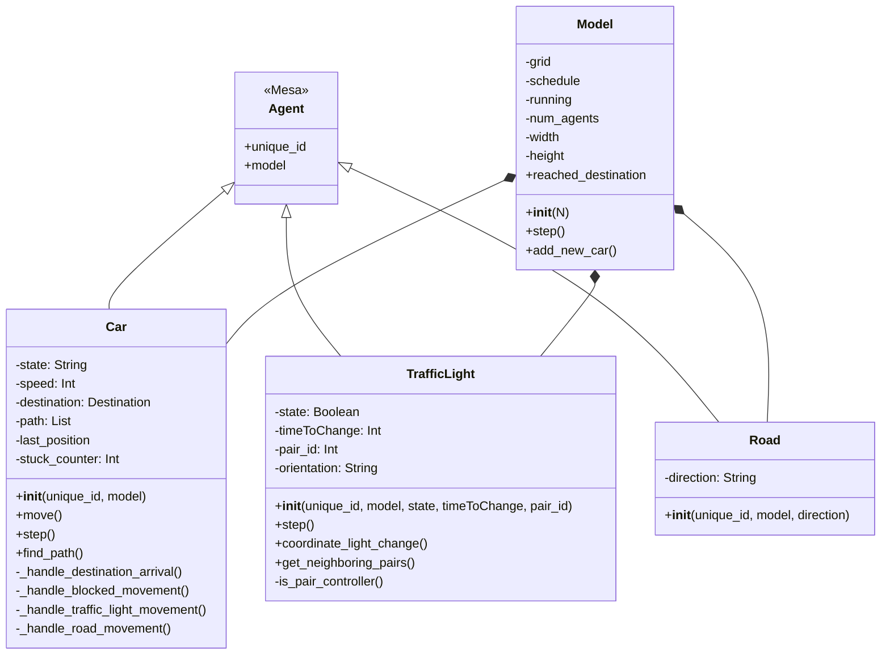
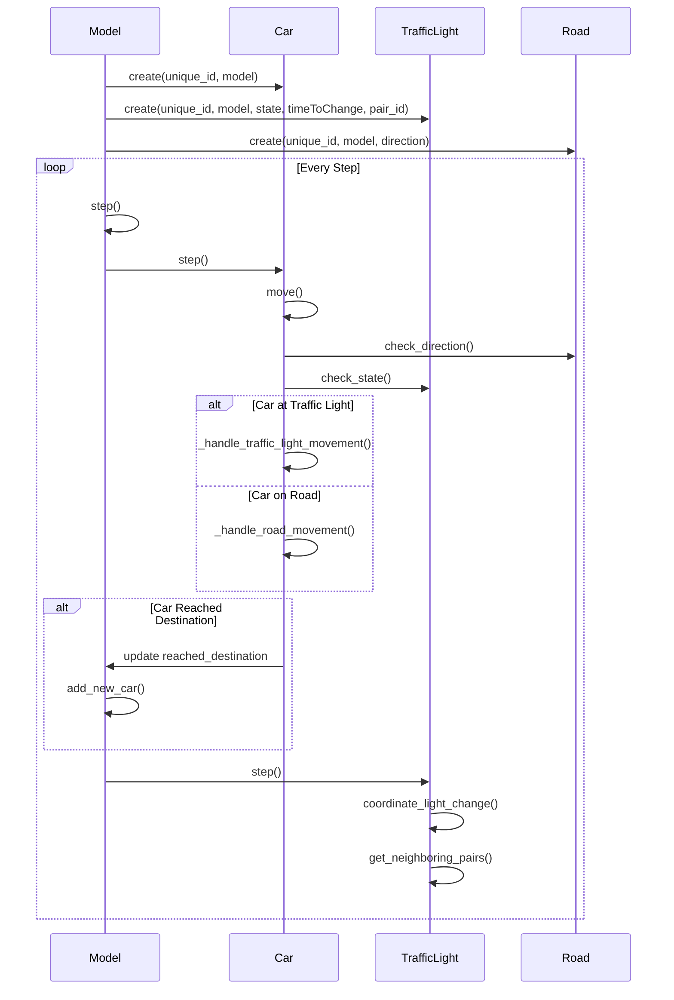

```mermaid

classDiagram
    class Model {
        -grid
        -schedule
        -running
        -num_agents
        -width
        -height
        +__init__(N)
        +step()
        +add_new_car()
        +reached_destination
    }

    class Car {
        -state: String
        -speed: Int
        -destination: Destination
        -path: List
        -last_position
        -stuck_counter: Int
        +__init__(unique_id, model)
        +move()
        +step()
        +find_path()
        -_handle_destination_arrival()
        -_handle_blocked_movement()
        -_handle_traffic_light_movement()
        -_handle_road_movement()
    }

    class TrafficLight {
        -state: Boolean
        -timeToChange: Int
        -pair_id: Int
        -orientation: String
        +__init__(unique_id, model, state, timeToChange, pair_id)
        +step()
        +coordinate_light_change()
        +get_neighboring_pairs()
        -is_pair_controller()
    }

    class Road {
        -direction: String
        +__init__(unique_id, model, direction)
    }

    class Agent {
        <<Mesa>>
        +unique_id
        +model
    }

    Agent <|-- Car
    Agent <|-- TrafficLight
    Agent <|-- Road
    Model *-- Car
    Model *-- TrafficLight
    Model *-- Road

```


```mermaid
sequenceDiagram
    participant Model
    participant Car
    participant TrafficLight
    participant Road

    Model->>Car: create(unique_id, model)
    Model->>TrafficLight: create(unique_id, model, state, timeToChange, pair_id)
    Model->>Road: create(unique_id, model, direction)
    
    loop Every Step
        Model->>Model: step()
        Model->>Car: step()
        Car->>Car: move()
        Car->>Road: check_direction()
        Car->>TrafficLight: check_state()
        
        alt Car at Traffic Light
            Car->>Car: _handle_traffic_light_movement()
        else Car on Road
            Car->>Car: _handle_road_movement()
        end

        alt Car Reached Destination
            Car->>Model: update reached_destination
            Model->>Model: add_new_car()
        end

        Model->>TrafficLight: step()
        TrafficLight->>TrafficLight: coordinate_light_change()
        TrafficLight->>TrafficLight: get_neighboring_pairs()
    end
```

```
