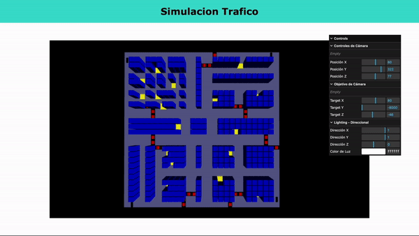
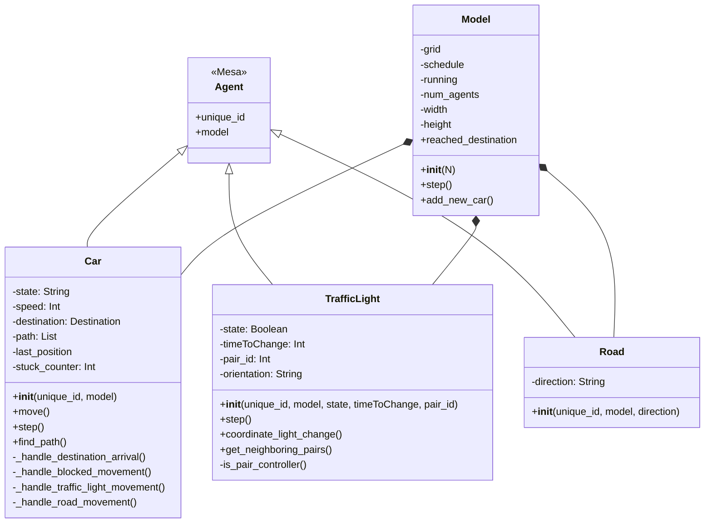
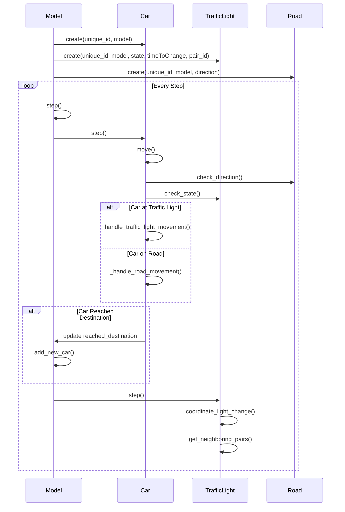

Here's the updated README.md:

# Simulador de Movilidad Urbana - TC2008B.302

## 📚 Índice

1. [Demo del Proyecto](#-demo-del-proyecto)
2. [Diagramas](#-diagramas)
3. [Reporte Completo](#-reporte-completo)
4. [Descripción del Proyecto](#-descripción-del-proyecto)
5. [Equipo](#-equipo-del-proyecto)
6. [Funcionalidades](#-funcionalidades)
7. [Tecnologías](#️-tecnologías-y-herramientas)
8. [Instalación](#-instalación-y-uso)
9. [Métricas](#-métricas-y-análisis)

## 🎥 Demo del Proyecto



## 📄 Reporte Completo

El reporte detallado del proyecto se puede encontrar en [Informe Final](Evidencias/Evidencia%201.%20Reporte%20del%20reto.pdf)

## 📊 Diagramas

### Diagrama de Clases



### Diagrama de Interacción



## 📄 Reporte Completo

El reporte detallado del proyecto se puede encontrar en [Informe Final](Evidencias/Evidencia%201.%20Reporte%20del%20reto.pdf)

## 📋 Descripción del Proyecto

Sistema de simulación multiagente enfocado en resolver problemas de movilidad urbana en México. El proyecto implementa estrategias para reducir la congestión vehicular mediante:

- Optimización de rutas
- Control inteligente de semáforos
- Análisis de patrones de tráfico
- Visualización en tiempo real

## 👥 Equipo del Proyecto

### Profesores Titulares

- Octavio Navarro Hinojosa
- Gilberto Echeverría Furió

### Estudiantes Desarrolladores

- Emilio Ramírez Mascarúa - A01783980
- Kenia Esmeralda Ramos Javier - A01799073

## 🛠️ Instalación y Uso

### Requisitos Previos

- Python 3.x
- Node.js
- npm

### Backend (Servidor de Agentes)

1. Instalar dependencias de Python:

```bash
pip install mesa==2.1.1
pip install flask-cors
pip install flask
```

2. Ejecutar el servidor:

```bash
python -m src.visualization.trafficServer
```

### Frontend (Visualización)

1. Navegar al directorio de visualización:

```bash
cd AgentsVisualization/visualization
```

2. Instalar dependencias:

```bash
npm i
```

3. Iniciar el servidor de desarrollo:

```bash
npx vite
```

4. Abrir el navegador en la URL proporcionada o presionar 'o'

## 🚀 Funcionalidades

### 1. Sistema Base

- Grid 2D del ambiente urbano
- Agentes vehiculares básicos
- Sistema de visualización 3D con WebGL
- Métricas fundamentales

### 2. Sistema de Tráfico

- Red de calles y direcciones
- Control de semáforos con iluminación dinámica
- Gestión de velocidades
- Análisis de densidad

### 3. Sistema de Interacción

- Detección de colisiones
- Comportamiento vehicular realista
- Gestión de intersecciones
- Métricas de congestión

### 4. Sistema de Navegación

- Algoritmos de pathfinding A*
- Optimización de rutas
- Análisis de tiempos
- Visualización de trayectorias

## 📊 Métricas y Análisis

- Densidad de tráfico en tiempo real
- Tiempos de viaje por vehículo
- Niveles de congestión en intersecciones
- Eficiencia de rutas y llegadas exitosas
- Comportamiento de semáforos

## 📝 Licencia

MIT License

Este README proporcigna una visión completa del proyecto, incluyendo la demostración visual, documentación técnica y guías de instalación. Los diagramas y el reporte completo ayudan a entender la arquitectura y funcionamiento del sistema.
